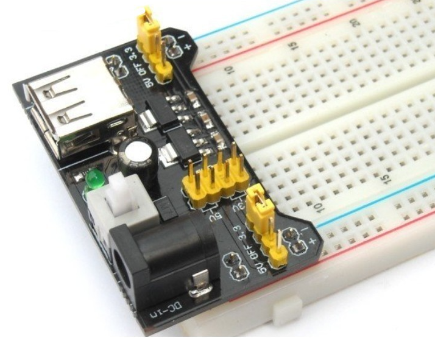
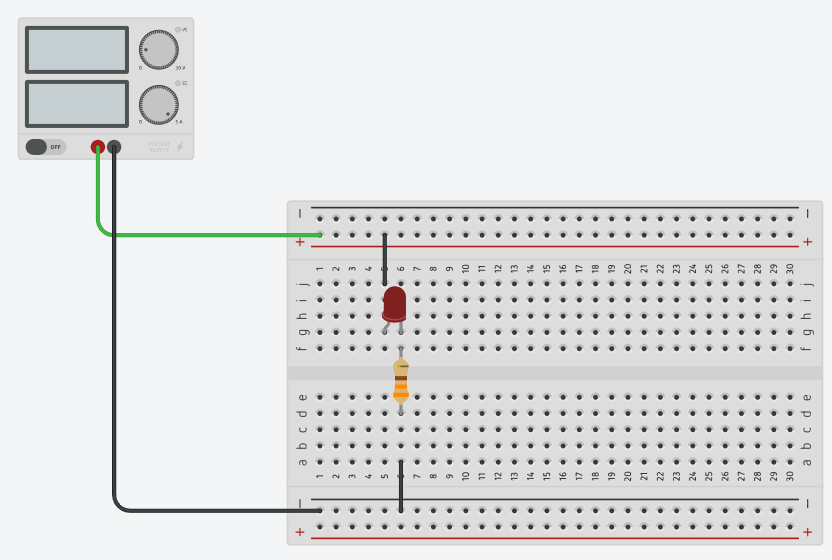

::: {.callout-tip}
## Recommended viewing: Ben Eater's Digital Electronics Series
Throughout the initial labs (Labs 1–9), we strongly recommend watching the video series **"Basic digital electronics with Ben Eater"** available in the Canvas module of the same name. Ben Eater explains fundamental electronics concepts — voltage, current, resistors, transistors, logic gates — with excellent visual clarity. Watching these videos alongside the labs will deepen your understanding significantly.
:::

## Learning Goals

- Understand LED polarity (anode/cathode) and forward voltage
- Learn why current limiting is essential
- Use a multimeter to measure voltage and current
- Understand the difference between adjustable and fixed power supplies

## Background

A Light Emitting Diode (LED) emits light when current flows through it in the correct direction. Unlike a resistor, an LED has a nearly fixed **forward voltage** ($V_f$) — typically around 2V for a red LED — and will allow increasing current as voltage rises above $V_f$. Without current limiting, the LED draws excessive current and burns out.

## Part A — Demonstration: Adjustable Power Supply

During the lecture, Mirza demonstrated three key concepts using the adjustable bench power supply:

1. **Forward voltage discovery.** Starting at 0 V with a 20 mA current limit, the voltage was slowly increased. The LED began conducting at its "knee" voltage (~1.6–1.8 V for red). Above $V_f$, current rises steeply — the supply's current limit was the only thing protecting the LED.

2. **Without current limiting.** The current limit was removed and 5 V applied to a sacrificial LED — it burned out instantly. The LED's resistance drops to near zero above $V_f$, so current spikes to whatever the supply can deliver.

3. **Reverse polarity.** The LED was connected backwards — nothing happened. An LED is a diode: it only conducts in one direction.

<!-- TODO: Replace with recorded video link -->

<!-- Review the video above before starting Part B. -->

### Try it in the simulator

Before touching real components, explore these circuits in [Falstad's online simulator](https://www.falstad.com/circuit/circuitjs.html). Double-click components to change their values.

**LED without resistor (adjustable supply)** — Slide the voltage from 0 V to 5 V. Watch the current spike once you pass the forward voltage. This is why the LED burns out without current limiting.

<iframe src="https://www.falstad.com/circuit/circuitjs.html?ctz=DwYwlgTgBAZgvAIgIwKgFwM6IAwDpsEECsqYIiSeATAVQOx0DM2AHFQGwCcndqIARoiLZUAB0EJhqAG4QhqALaYhAUwC0SFAD4AUFCjAA5lAAeidixZQALJ3ZQLVolRap4CEQHpd+4ACVTc0soRmcHYJdXWAp2VAB3dxEoBQBDE2kKXE4qBG89AwAZAFEAEUCERxCwyuskWOiPRQB7RAATFRgUgFcAGzQ1HpVWvjlkPkMcPgkkhX5yD3wUPN848pq68KtbevclnwMU1oArKBUKVBUwSdOAO0QANSa+lMMVRTvG5LNkHKgMNAeTzQLzeeWAnnAEF0QA" width="100%" height="400" style="border: 1px solid #ccc; border-radius: 8px;"></iframe>

[Open in full screen](https://www.falstad.com/circuit/circuitjs.html?ctz=DwYwlgTgBAZgvAIgIwKgFwM6IAwDpsEECsqYIiSeATAVQOx0DM2AHFQGwCcndqIARoiLZUAB0EJhqAG4QhqALaYhAUwC0SFAD4AUFCjAA5lAAeidixZQALJ3ZQLVolRap4CEQHpd+4ACVTc0soRmcHYJdXWAp2VAB3dxEoBQBDE2kKXE4qBG89AwAZAFEAEUCERxCwyuskWOiPRQB7RAATFRgUgFcAGzQ1HpVWvjlkPkMcPgkkhX5yD3wUPN848pq68KtbevclnwMU1oArKBUKVBUwSdOAO0QANSa+lMMVRTvG5LNkHKgMNAeTzQLzeeWAnnAEF0QA)

**LED with 300 Ω resistor (12V supply)** — The resistor limits current to a safe level. Try changing the resistor value (double-click it) — what happens with 100 Ω? 1 kΩ?

<iframe src="https://www.falstad.com/circuit/circuitjs.html?ctz=DwYwlgTgBAZgvAIgIwKgFwM6IAwDpsEECsqYIiSeATAVQOx0DM2AHFQGwCcndqIARoiLZUAB0EJhqAG4QhqALaYhAUwC0SFAD4AUFCjAA5lAAeidixZQiddlAtX2rVPAQiA9Lv3AASqfOWUIxEVPaBVJYuFOyoAO6uIlAKAIYm0hRUCJ56BgAyAKIAIv4IDkEhYVYALEgxsDiKAPaIACYqMMkArgA2aGrdKi18csh8hg1QAhMK-ORu+CjZ3rElZTV2a+xVUaNLBtBmpYFVW5XWtjuJI8weXgbJLQBWUCoUqCpgEyoAdogAao1eslDCpFL83IpDkhMlAMGh-oC0MDQdlgO5wBBdEA" width="100%" height="400" style="border: 1px solid #ccc; border-radius: 8px;"></iframe>

[Open in full screen](https://www.falstad.com/circuit/circuitjs.html?ctz=DwYwlgTgBAZgvAIgIwKgFwM6IAwDpsEECsqYIiSeATAVQOx0DM2AHFQGwCcndqIARoiLZUAB0EJhqAG4QhqALaYhAUwC0SFAD4AUFCjAA5lAAeidixZQiddlAtX2rVPAQiA9Lv3AASqfOWUIxEVPaBVJYuFOyoAO6uIlAKAIYm0hRUCJ56BgAyAKIAIv4IDkEhYVYALEgxsDiKAPaIACYqMMkArgA2aGrdKi18csh8hg1QAhMK-ORu+CjZ3rElZTV2a+xVUaNLBtBmpYFVW5XWtjuJI8weXgbJLQBWUCoUqCpgEyoAdogAao1eslDCpFL83IpDkhMlAMGh-oC0MDQdlgO5wBBdEA)

## Part B — Hands-On Lab (Fixed 12V Supply + Breadboard Adapter)

Your workstation should have a **12V power supply** and a **breadboard power adapter** that provides fixed **5V** and **3.3V** rails. Since these are fixed voltages (no current limiting), you **must** use a series resistor to protect the LED.

### Components

- 1× LED (red or green, through-hole)
- 1× 330 Ω resistor
- 12V power supply + breadboard power adapter (5V / 3.3V)
- Multimeter
- Breadboard and jumper wires

### Tasks

<!--  -->

<iframe src="https://www.tinkercad.com/embed/hXRHG2KC7i8-current-limiting-led?sharecode=tZ0dc8NoJuO3X3Q6UMZMobpWsv1rM41ap6QzdA4PKjw" width="100%" height="400" style="border: 1px solid #ccc; border-radius: 8px;"></iframe>

1. **Set up the breadboard.** Plug in the power adapter and select the **5V** rail. Verify the voltage with your multimeter.

2. **Connect the LED with a resistor.** Wire the LED in series with a 330 Ω resistor from the 5V rail to GND. Observe polarity (long leg = anode = +). The LED should light up.

3. **Measure the forward voltage.** Place your multimeter probes across the LED (not the resistor). Record $V_f$.

4. **Calculate the current.** Using Ohm's law, calculate the current through the LED:
   $$I = \frac{V_{supply} - V_f}{R}$$
   For example: $I = \frac{5V - 2V}{330\,\Omega} \approx 9\,\text{mA}$

5. **Try 3.3V.** Switch the breadboard adapter to 3.3V. Does the LED still light? Measure $V_f$ again. Calculate the new current. Is it brighter or dimmer than at 5V?

6. **Reverse the LED.** Flip the LED around. What happens?

### Questions

1. Why does the LED not light up when connected in reverse?
2. Why is connecting an LED directly to a voltage source (without a resistor or current limit) dangerous?
3. What would happen if you used a 100 Ω resistor instead of 330 Ω? Calculate the current.
4. A blue LED has $V_f \approx 3.2V$. Would it work reliably on the 3.3V rail with a 330 Ω resistor? Why or why not?

::: {.callout-warning}
LEDs without current limiting will burn out instantly. Always use either a current-limited supply or a series resistor.
:::

## Submission

Write a short lab report in Quarto following the [Report Writing Guide](01_Report_Writing_Guide.qmd). Include your measurements, calculations, and answers to the questions. Render to PDF and upload.
