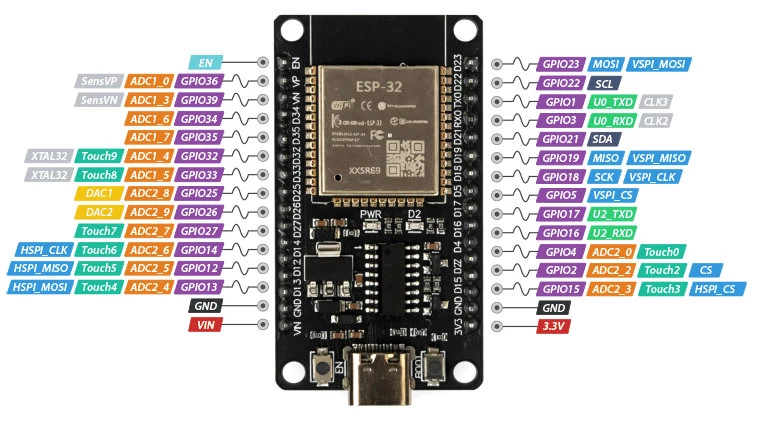
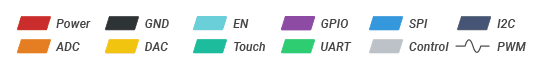
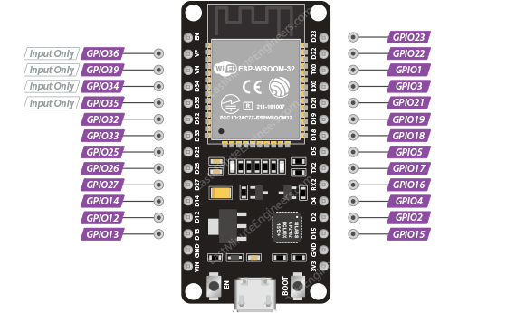
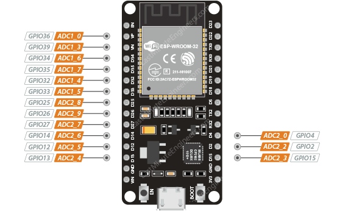

---
canvas:
  allowed_extensions:
  - pdf
  grading_type: pass_fail
  group_assignment: true
  group_set: Project Groups
  points: 1
  published: true
  submission_types:
  - online_upload
  type: assignment
title: Lab 3 – LED from ESP32
---

## Learning Goals

- First contact with the ESP32 microcontroller
- Write a simple program to control a digital output (GPIO)
- Understand the 3.3V logic level and its limitations

## Background

The ESP32 is the brain of the RC car. Its GPIO (General Purpose Input/Output) pins can be set HIGH (3.3V) or LOW (0V) from software. Each pin can source approximately **12mA** safely (absolute max 40mA). Since 3.3V is lower than 12V, the resistor calculation changes compared to Lab 2.

## Components

- ESP32 DevKit
- 1× LED + appropriate resistor
- USB cable
- Breadboard and jumper wires

<iframe src="https://wokwi.com/projects/459211802854439937?embed=1" width="100%" height="500" style="border: 1px solid #ccc; border-radius: 8px;"></iframe>

Click [here](https://wokwi.com/projects/459211802854439937) to open the project in Wokwi and experiment with the code and circuit!

## ESP32 Pinout




### GPIO pins

The ESP32 has 25 GPIO (General Purpose Input/Output) pins. Each pin can be configured as a digital input or output from your code. Some pins also support analog input (ADC), PWM output, or capacitive touch sensing — but for now, we only care about basic digital output: setting a pin HIGH (3.3V) or LOW (0V).



### Which ESP32 GPIOs are safe to use?

Not all GPIOs are created equal. Some are connected to the flash memory, some behave unexpectedly during boot, and some are input-only. The table below classifies each pin so you know which ones to reach for first.

| GPIO | Status | Notes |
|------|--------|-------|
| 4, 13, 14, 16, 17 | Safe | No restrictions |
| 18–27 | Safe | No restrictions |
| 32–33 | Safe | No restrictions |
| 0 | Caution | Must be HIGH during boot, LOW for programming |
| 2 | Caution | Must be LOW during boot, connected to on-board LED |
| 5 | Caution | Must be HIGH during boot |
| 12 | Caution | Must be LOW during boot |
| 15 | Caution | Must be HIGH during boot, prevents startup log if pulled LOW |
| 1 (TX0), 3 (RX0) | Avoid | Used for USB serial communication |
| 6–11 | Avoid | Connected to internal flash memory |
| 34, 35, 36, 39 | Avoid | Input only — cannot be set as output |

**Safe** pins are your go-to — use these first. **Caution** pins work but may cause issues during boot (e.g. preventing upload or causing unexpected output). **Avoid** pins are either reserved for internal use or physically unable to drive outputs.

::: {.callout-tip}
For this course, stick to the **safe** pins whenever possible. GPIO 4, 13, 14, 16–27, 32, and 33 give you plenty to work with.
:::

### Input-only GPIOs

GPIO 34, 35, 36 (VP), and 39 (VN) are **input only** — they cannot drive an output. Use them for reading sensors or buttons, but never for controlling LEDs or motors. They also lack internal pull-up/pull-down resistors, so you need external resistors if using them as inputs.

### ADC Pins (Analog Input)

Some GPIO pins can read analog voltages using the ESP32’s built-in ADC (Analog-to-Digital Converter). The ADC is 12-bit, meaning it maps 0–3.3V to an integer value 0–4095 (resolution of ~0.8 mV per step). You read an analog pin with `analogRead(pin)`.



The ESP32 has two ADC units — **ADC1** and **ADC2** — across 15 channels total.

::: {.callout-warning}
**ADC2 pins cannot be used when Wi-Fi is active.** Since the RC car project uses Wi-Fi, only use **ADC1** pins (GPIO 32–36, 39) for analog input.
:::

### I2C Pins

I2C is a two-wire communication protocol used to talk to sensors and other devices. It uses a **SDA** (data) and **SCL** (clock) line. The ESP32 can use any GPIO for I2C, but the default pins are **GPIO 21 (SDA)** and **GPIO 22 (SCL)** — most libraries and examples assume these, so stick with them unless you have a reason not to.

Later in the course, we will use I2C to read the **AS5600** magnetic position sensor for measuring wheel speed of the RC car.

### PWM Pins

Any GPIO that supports output (i.e. all except the input-only pins) can generate a PWM signal. PWM (Pulse Width Modulation) rapidly switches a pin on and off to simulate an analog output — this is how we control LED brightness and motor speed. The ESP32 has 16 independent PWM channels, so you can drive multiple outputs at different duty cycles simultaneously.

We will use PWM extensively starting from Lab 4 (LED dimming) and later for motor control via the H-bridge.


### More info on the ESP

See [here](https://lastminuteengineers.com/esp32-pinout-reference/)

## Tasks

1. **Calculate** the appropriate resistor for an LED at 10mA from 3.3V.
2. Connect the LED + resistor between a GPIO pin (e.g. GPIO 2) and GND.
3. Upload the following program and verify the LED blinks:

```cpp
const int ledPin = 2;

void setup() {
  pinMode(ledPin, OUTPUT);
}

void loop() {
  digitalWrite(ledPin, HIGH);
  delay(500);
  digitalWrite(ledPin, LOW);
  delay(500);
}
```

4. **Measure** the voltage on the GPIO pin when HIGH and when LOW using the multimeter.
5. Modify the blink rate. Try 50ms on / 50ms off — can you still see it blinking?

## Questions

1. The ESP32 operates at 3.3V, but the car's motor runs at 12V. How can we bridge this gap? (Hint: this is the topic of Labs 6–9.)
2. What would happen if you connected the 12V motor directly to a GPIO pin?
3. Why is the ESP32's 3.3V logic level important to keep in mind throughout the project?

## Submission

Write a short lab report in Quarto following the [Report Writing Guide](../01_Fundamentals/01_Report_Writing_Guide.qmd). Include your resistor calculation, measured voltages, the code you used, and answers to the questions. Render to PDF and upload.