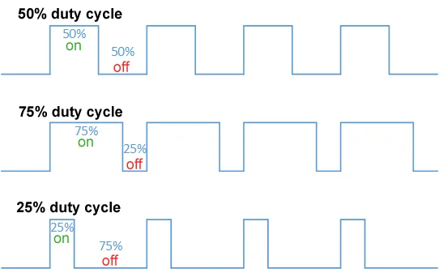

---
canvas:
  allowed_extensions:
  - pdf
  grading_type: pass_fail
  group_assignment: true
  group_set: Project Groups
  points: 1
  published: true
  submission_types:
  - online_upload
  type: assignment
title: Lab 4 – PWM Dimming from ESP32
---

## Learning Goals

- Understand Pulse Width Modulation (PWM) and how a digital signal produces an "analog" effect
- Observe PWM signals on the oscilloscope
- This is the same principle used to control motor speed and servo position

## Background

PWM rapidly switches a pin between HIGH and LOW. The **duty cycle** — the fraction of time the signal is HIGH — determines the average power delivered to the load:

- 0% duty = always LOW (LED off)
- 50% duty = half brightness
- 100% duty = always HIGH (LED full brightness)

The frequency is how fast the signal switches. If it's too low (e.g., 50 Hz), you can see the LED flickering. At higher frequencies (e.g., 5 kHz), it appears as steady dimming to the eye. For motor control, the frequency needs to be high enough to avoid current ripple and noise.



## PWM on ESP32


Unlike Arduino boards where only pins marked with `~` support PWM, the ESP32 can output PWM on almost any GPIO pin. This is because PWM is handled by a dedicated **LEDC** (LED Control) peripheral with 16 independent channels. You pick a pin, attach it to a channel, and the hardware does the rest.

**Pins you should avoid for PWM:**

- **GPIO 34–39** — input-only, cannot output any signal
- **GPIO 6–11** — connected to the internal flash memory, not usable
- **GPIO 0, 2, 15** — strapping pins that affect boot behavior (GPIO 2 is fine after boot, which is why the example code uses it)

The LEDC peripheral lets you configure both **frequency** and **resolution** per channel. In this lab you will use three functions:

1. `ledcSetup(channel, freq, resolution)` — configure a PWM channel
2. `ledcAttachPin(pin, channel)` — attach a GPIO pin to that channel
3. `ledcWrite(channel, duty)` — set the duty cycle on the channel

Note that you address the **channel** (0–15), not the pin, when writing the duty cycle.

### Resolution

The **resolution** (in bits) determines how many steps you have between fully off and fully on:

| Resolution | Steps | Duty range | Example: 50% duty |
|------------|-------|------------|--------------------|
| 8-bit      | 256   | 0–255      | 128                |
| 10-bit     | 1024  | 0–1023     | 512                |
| 16-bit     | 65536 | 0–65535    | 32768              |

Higher resolution gives finer control. For dimming an LED, 8-bit (256 steps) is more than enough. For positioning a servo (Lab 11), 16-bit resolution is needed because a small change in duty cycle corresponds to a small change in angle -- with only 256 steps the servo would jump between positions.

### Resolution vs. Frequency Tradeoff

You cannot have both high resolution and high frequency at the same time. The LEDC peripheral is driven by the ESP32's 80 MHz clock, and the clock has to count through all the steps in one PWM cycle. This means:

$$\text{frequency} \times 2^{\text{resolution}} \leq 80{,}000{,}000$$

The higher the resolution, the more clock ticks per cycle, leaving fewer cycles per second:

| Resolution | Max frequency | Use case |
|------------|--------------|----------|
| 8-bit (256 steps) | 312.5 kHz | LED dimming |
| 10-bit (1024 steps) | 78.1 kHz | Motor PWM |
| 16-bit (65536 steps) | 1220 Hz | Servo control at 50 Hz |

For example, servo control needs 50 Hz and fine angle control, so 16-bit works well ($50 \times 65536 = 3.3\text{M}$, well under 80M). But 16-bit at 5 kHz would require $5000 \times 65536 = 327\text{M}$ clock ticks per second -- impossible with an 80 MHz clock. If you try, `ledcSetup` will silently reduce the resolution to fit.

In this lab you will experiment with this: Task 6 asks you to set 50 Hz with 16-bit resolution (servo settings), while the earlier tasks use 5 kHz with 8-bit (LED dimming). Both combinations stay well within the 80 MHz limit.

Note that this constraint applies **per channel**, not as a total across all channels. The LEDC has 8 independent timers, each with its own clock divider. You can run one channel at 5 kHz/8-bit for an LED and another at 50 Hz/16-bit for a servo at the same time -- they don't compete for clock cycles.

### Hardware Peripheral vs. Software

This is possible because the LEDC is a **hardware peripheral** -- dedicated circuitry on the chip that generates PWM signals independently of the CPU. Once you call `ledcSetup` and `ledcWrite`, the hardware takes over. The CPU does not spend any time toggling pins; it is free to do other work.

The alternative would be *bit-banging*: toggling a pin HIGH and LOW in a loop with precise timing, like this:

```cpp
// Bit-banging (bad) -- the CPU does all the work
while (true) {
    digitalWrite(pin, HIGH);
    delayMicroseconds(onTime);
    digitalWrite(pin, LOW);
    delayMicroseconds(offTime);
}
```

This ties up the CPU completely -- it can't do anything else while generating the signal, and any interrupt (like serial communication) would cause timing jitter. With a hardware peripheral, you get rock-steady PWM on up to 16 channels simultaneously while the CPU runs your program logic. The ESP32 is actually a dual-core processor (two Xtensa LX6 cores), but even a single core can handle complex tasks while the LEDC peripheral runs all PWM channels in the background.

::: {.callout-warning}
## PlatformIO uses Arduino Core v2.x

PlatformIO's `espressif32` platform currently ships with **Arduino Core v2.x**. If you search online you may find examples using the newer v3.x API (`ledcAttach(pin, freq, res)`), but that will not compile. The v2.x API used in this lab requires a separate setup and attach step:

| v2.x (PlatformIO default) | v3.x (newer) |
|--------------------|-------------------------------|
| `ledcSetup(channel, freq, res)` | `ledcAttach(pin, freq, res)` |
| `ledcAttachPin(pin, channel)` | *(included above)* |
| `ledcWrite(channel, duty)` | `ledcWrite(pin, duty)` |

If you get a compilation error about `ledcAttach` not being declared, you are mixing up the two APIs.
:::

## Components

- ESP32 DevKit
- 1× LED + resistor (from Lab 3)
- Oscilloscope

::: {.callout-note}
Oscilloscopes are in short supply — we are borrowing them from the Electronics department. Start with Tasks 1, 5, and 6 (LED observation only) and come back to the oscilloscope tasks (2–4) when one becomes available. The deadline for this lab is flexible; don't wait around for a scope, move on to the next lab and return to this when you can.
:::

## Tasks

1. Upload the following code and observe the LED smoothly fading:

```cpp
#include <Arduino.h>

const int ledPin = 2;
const int pwmChannel = 0;
const int pwmFreq = 5000;     // 5 kHz
const int pwmResolution = 8;  // 8-bit: 0–255

void setup() {
  ledcSetup(pwmChannel, pwmFreq, pwmResolution);
  ledcAttachPin(ledPin, pwmChannel);
}

void loop() {
  for (int duty = 0; duty <= 255; duty++) {
    ledcWrite(pwmChannel, duty);
    delay(10);
  }
  for (int duty = 255; duty >= 0; duty--) {
    ledcWrite(pwmChannel, duty);
    delay(10);
  }
}
```

2. Connect the oscilloscope to the GPIO pin. Observe the PWM waveform.
3. **Measure** the frequency — does it match the configured 5 kHz?
4. Set the duty to 64 (25%), 128 (50%), and 192 (75%). **Measure** the duty cycle on the oscilloscope and compare with expected values.
5. Change the frequency to 50 Hz. Can you see the LED flickering now? Why?
6. Change the frequency to 50 Hz and resolution to 16-bit. This is the setting used for servo control (Lab 11).

### Serial Control

In Lab 0 you used the serial monitor to send text commands to the ESP32. Here you will use the same idea to control the PWM signal interactively. The key functions are:

- `Serial.readStringUntil('\n')` — reads a line of text from the serial monitor
- `string.toInt()` — converts a text string like `"128"` to the integer `128`

::: {.callout-tip}
We use the Arduino `String` class here for simplicity. In the Arduino community there are concerns about `String` causing memory fragmentation and crashes — this is a real problem on AVR boards with only 2 KB of RAM. The ESP32 has ~320 KB of RAM and a better memory allocator, so for simple interactive code like this it is perfectly safe. In production firmware with high-frequency string operations you would use C-style `char[]` buffers instead.
:::

7. Upload the following code. Use the serial monitor to type a duty cycle value (0–255) and press Enter. The LED brightness should change immediately.

```cpp
#include <Arduino.h>

const int ledPin = 2;
const int pwmChannel = 0;
int pwmFreq = 5000;
const int pwmResolution = 8;

void setup() {
  Serial.begin(115200);
  ledcSetup(pwmChannel, pwmFreq, pwmResolution);
  ledcAttachPin(ledPin, pwmChannel);
  Serial.println("Enter 'duty <value>' (0-255) or 'freq <value>' (Hz)");
}

void loop() {
  if (Serial.available()) {
    String input = Serial.readStringUntil('\n');
    input.trim();

    if (input.startsWith("duty ")) {
      int duty = input.substring(5).toInt();
      duty = constrain(duty, 0, 255);
      ledcWrite(pwmChannel, duty);
      Serial.print("Duty set to ");
      Serial.println(duty);
    } else if (input.startsWith("freq ")) {
      pwmFreq = input.substring(5).toInt();
      ledcSetup(pwmChannel, pwmFreq, pwmResolution);
      Serial.print("Frequency set to ");
      Serial.print(pwmFreq);
      Serial.println(" Hz");
    } else {
      Serial.println("Unknown command. Try: duty 128, freq 1000");
    }
  }
}
```

8. Try different combinations: `freq 50` then `duty 128` — can you see the flicker? Now try `freq 5000` with the same duty. Use the oscilloscope to verify.

## Questions

1. Why does PWM at 5 kHz appear as steady dimming to the eye, but 50 Hz flickers?
2. What is the difference between 8-bit resolution (256 steps) and 10-bit resolution (1024 steps)?
3. The BTS7960 motor driver accepts PWM input to control motor speed. What duty cycle would give half speed?

## Submission

Write a short lab report in Quarto following the [Report Writing Guide](../01_Fundamentals/01_Report_Writing_Guide.qmd). Include oscilloscope screenshots showing the PWM waveform at different duty cycles, your frequency measurements, and answers to the questions. Render to PDF and upload.