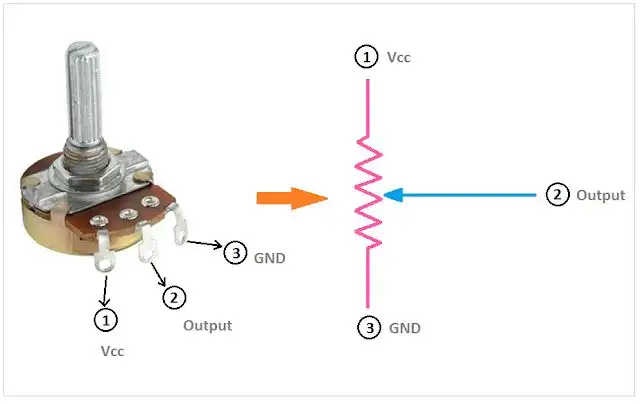
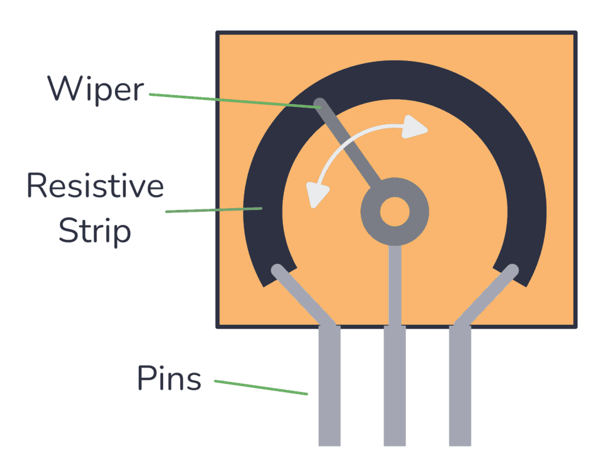
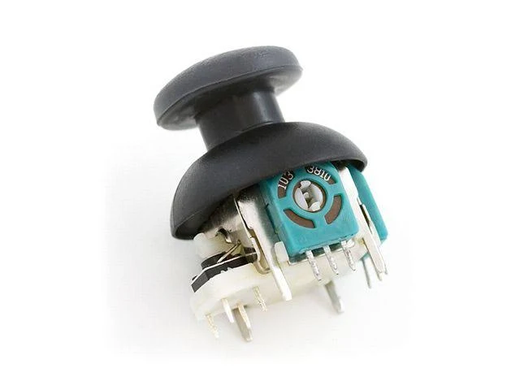

---
canvas:
  allowed_extensions:
  - pdf
  grading_type: pass_fail
  group_assignment: true
  group_set: Project Groups
  points: 1
  published: true
  submission_types:
  - online_upload
  type: assignment
title: Lab 5 – PWM Controlled by Potentiometer
---

## Learning Goals

- Read an analog sensor using the ESP32's ADC (Analog-to-Digital Converter)
- Create your first sensor → actuator control loop
- This is the same principle as joystick → motor in the car

## Background

A potentiometer is a variable resistor that outputs a voltage proportional to its position. The ESP32's ADC converts this analog voltage (0–3.3V) into a digital value. With the default 12-bit resolution, readings range from 0 to 4095.

This lab creates the pattern: **read sensor → process → drive actuator** — the fundamental loop of any mechatronic system.

## Components

- ESP32 DevKit
- 1× Potentiometer (10kΩ)
- 1× LED + resistor
- Breadboard and jumper wires






Note: The joysticks are just made up of two potentiometers, one for the x-axis and one for the y-axis.




## How Potentiometers Work

A potentiometer is a three-terminal resistor with a sliding contact (the **wiper**) that moves along a resistive strip. The two outer pins are connected to the ends of the strip, giving a fixed total resistance (10 kOhm in our case). The center pin is the wiper -- its resistance to each outer pin changes as you turn the knob, but always sums to the total.

When you connect the outer pins to 3.3V and GND, the wiper acts as a **voltage divider**: it outputs a voltage between 0V and 3.3V proportional to its position. This is the signal we feed into the ESP32's ADC.

<iframe src="https://www.falstad.com/circuit/circuitjs.html?ctz=DwYwlgTgBAZgvAIgIwKgFwM6IAwDpsEECsqYIiSeATAVQOx0DM2AHFQGwCcndqIARoiLZUAB0EJhqAG4QhqALaYhAUwC0SFAD4AUFCjAA5lAAeiACwEo5zu2tWiVFqngIRAel37gAJVMWrKipze2woJHYRWAp2VAB3VyiFAEMTaQoqBE89Azj-BEswoJDCqHpM6OQsrwNoMwLAuipQqEYWcxccVDlkQmqc4FE0fKailhYoJjtzCM6qqBSKPqhRAHscXBIoDAAbRB8VDDAMNGSAOxAVfu86gLC2kqsbWMqonsoCa9z80ofrW1a7TmmWy3j89VGZWCkxo4Uic1mUASXQWqXSyBBNWAeQhsOKMLGzkqKFB3whjDsjEcUBYEVajmBXyMI1hMzskPMLCiiSZyQAJgArKAqCioFRgFEqM6IABqqx2p0MVwW0rcinqSAqJ1l8sVV2ywHc4AguiAA" width="100%" height="400" style="border: 1px solid #ccc; border-radius: 8px;"></iframe>


::: {.callout-note}
The total resistance of the potentiometer matters. A low-value pot (e.g. 100 Ohm) across 3.3V would draw 33 mA -- wasting power and potentially overloading the supply. A very high-value pot (e.g. 1 MOhm) draws almost no current but becomes sensitive to electrical noise, giving unstable ADC readings. 10 kOhm is a good middle ground: low current draw (0.33 mA) and clean signal.
:::

Watch this short video for a visual explanation:

<iframe width="560" height="315" src="https://www.youtube.com/embed/Xb-MZMoUtcQ" frameborder="0" allowfullscreen></iframe>


## Tasks

### Part A: Measure Before You Connect

::: {.callout-warning}
Always verify a component's behavior with a multimeter before connecting it to the ESP32. A short circuit or unexpected voltage on a GPIO pin can permanently damage the microcontroller.
:::

1. Use the multimeter in **resistance mode** (Ohm). Measure the resistance across the two outer pins of the potentiometer. This is the total resistance -- it should be around 10 kOhm. Now measure from one outer pin to the center (wiper) pin while turning the knob. You should see the resistance change from near 0 to the total value.

2. Do the same for the **joystick module** -- it contains two potentiometers (X and Y axes). Identify the three pins for each axis and measure the resistance range.

### Part B: Voltage Divider Test (No ESP32!)

3. Connect the potentiometer to the **breadboard power supply** (3.3V and GND) -- **not** the ESP32. One outer pin to 3.3V, the other to GND.

4. Use the multimeter in **voltage mode** (DC). Measure the voltage between the center (wiper) pin and GND at three positions: fully left, center, and fully right. You should see the voltage range from near 0V to near 3.3V. Record these values.

5. Do the same for one axis of the joystick. Verify that center position gives roughly half the supply voltage (1.65V).

::: {.callout-tip}
What you just tested is a **voltage divider** -- the potentiometer splits the supply voltage proportionally to the wiper position. This is the signal the ESP32's ADC will read. By testing with the breadboard power supply first, you've confirmed the component works correctly and outputs a safe voltage range (0--3.3V) before connecting it to the microcontroller.
:::

### Part C: Connect to ESP32

6. Now wire the potentiometer to the ESP32: one outer pin to 3.3V, the other to GND, the center (wiper) to GPIO 34 (ADC input).

<iframe src="https://wokwi.com/projects/459819980118969345?embed=1" width="100%" height="500" style="border: 1px solid #ccc; border-radius: 8px;"></iframe>

7. Upload the code below. Open the Serial Monitor and turn the potentiometer.

```cpp
const int potPin = 34;
const int ledPin = 4;
const int pwmFreq = 5000;
const int pwmResolution = 8;

void setup() {
  Serial.begin(115200);
  ledcAttach(ledPin, pwmFreq, pwmResolution);
}

void loop() {
  int potValue = analogRead(potPin);           // 0-4095
  int pwmValue = map(potValue, 0, 4095, 0, 255); // scale to 8-bit
  ledcWrite(ledPin, pwmValue);

  Serial.print("Pot: ");
  Serial.print(potValue);
  Serial.print(" -> PWM: ");
  Serial.println(pwmValue);

  delay(50);
}
```

8. Verify that the LED brightness follows the potentiometer position smoothly.
9. Compare the ADC readings to your multimeter measurements from Part B. Does the ADC value match what you expect (`value / 4095 * 3.3V`)?
10. Slowly turn the potentiometer to its minimum and maximum positions. Does the ADC reading reach exactly 0 and 4095?

::: {.callout-note}
The ESP32's ADC is known to be **non-linear at the extremes**. Below about 100 mV and above about 3.2V, the readings become inaccurate -- you may never see a true 0 or 4095. This is a hardware limitation of the ESP32, not a wiring mistake. For most applications (including our RC car) this is not a problem, but it is good to be aware of it. If you need precise measurements, you would use an external ADC chip.
:::

11. Replace the potentiometer with the **joystick module**. Read both X and Y axes and print values to Serial. You have all the information you need from the previous tasks -- figure out the wiring and code yourself.

## Questions

1. Why do we use `map()` to convert 0–4095 to 0–255?
2. The joystick in the RC car controller works exactly like a potentiometer. What value do you expect at center position?
3. If the ADC reads 2048, what voltage is at the input pin?

**Bonus questions for the interested**: Do you think that you can design a car controller using a standard potentiometer as the throttle wheel that returns to center when released? Why or why not? What kind of sensor would be better for this application? If you find something cheap on amazon or aliexpress, let Mirza know and he might be able to get it for you. 

## Submission

Write a short lab report in Quarto following the [Report Writing Guide](../01_Fundamentals/01_Report_Writing_Guide.qmd). Include a table of potentiometer positions vs. measured voltages vs. ADC readings, your code, and answers to the questions. Render to PDF and upload.