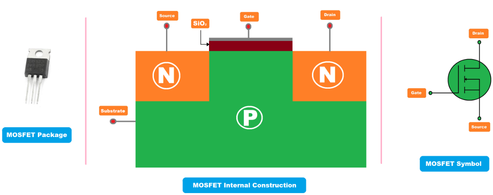

---
canvas:
  allowed_extensions:
  - pdf
  grading_type: pass_fail
  group_assignment: true
  group_set: Project Groups
  points: 1
  published: true
  submission_types:
  - online_upload
  type: assignment
title: Lab 6 – 12V LED with N-Channel MOSFET
---

## Learning Goals

- Use a MOSFET as an electronic switch to control a 12V load from the ESP32's 3.3V logic
- Understand gate threshold voltage and low-side switching
- This is a building block for the H-bridge motor driver

## Background

The ESP32's GPIO pins output 3.3V and can only source ~12mA — far too little to drive a motor. A **MOSFET** acts as a voltage-controlled switch:

- **Gate (G):** control terminal — connected to ESP32 GPIO
- **Drain (D):** connected to the load
- **Source (S):** connected to GND

When the gate voltage exceeds the **threshold voltage** ($V_{GS(th)}$), the MOSFET turns on. An N-channel MOSFET switches the **low side** (between load and GND).

We use the **IRL540N** — a logic-level N-channel MOSFET with $V_{GS(th)} \approx 2V$, so the ESP32's 3.3V fully turns it on.

::: {.callout-warning}
Make sure you use a **logic-level** MOSFET (like IRL540N). Standard MOSFETs (like IRF540N — note: no "L") require 5–10V at the gate and will not fully turn on with 3.3V.
:::

<iframe src="https://www.falstad.com/circuit/circuitjs.html?ctz=DwYwlgTgBAZgvAIgIwKgFwM6IAwDpsEEAsAnGeRZQGypgiJICsuRA7AEytWsmtJIAOKkmwlUIAEaIAzNNQAHKQkbZUANwiJGqALaYtAUwC0-BAD4AUFCjAASlAAeWpOyhUiURi6irYDGlAA7vAIvjoAhg5qDOwIAPSW1sCBjs6u7p7e-LF+yPGJNgAyAKIAIqnKWVyZruxEviFhAPaIACYGMOEArgA2aEY9Bq3imnlQIADmOOJKYRL0ofgoCVY2ExVetRw1UNLsDdMrSRgVREQCUOyMVLtUF1cBjfmrdhXSd5f1txdIJDkhSACwWmUAiURkuDkRxs0CclVc2R2SC4qCeUFGKlU0OAMFO50u1x2D1RMhyajQDFw2igEgMDCxBVecPe90JLN2+xJyCBIX+oyoYUi0QQ0khqFaXTQAE8AMJSkCDHAsIjPJJNKAGAB2DFQGHkiHcXIccig+tC5lWSXkUGFvgwC050KtNpkuoWeGwV1VNjiTUZ4VaACsNSCDGBQ9qEAA1Jp9cITAy6SNhOEuXUU6OxtDxxPYgPBukIASoMNaEuR0qSqVQOUKxOg5O6VMEdOISvSmvywbPYBxcAQSxAA" width="100%" height="400" style="border: 1px solid #ccc; border-radius: 8px;"></iframe>

### Datasheets

We have two N-channel MOSFETs available in the lab. You will need these datasheets for the exercises below:

- **IRL540N** (logic-level power MOSFET): [IRL540N datasheet (PDF)](https://www.electrokit.com/upload/quick/5c/e9/5c88_irl540n.pdf)
- **2N7000G** (logic-level MOSFET): [2N7000G datasheet (PDF)](https://docs.rs-online.com/aadc/0900766b813842af.pdf)

### Pull-Down and Pull-Up Resistors

A MOSFET gate has extremely high impedance — essentially no current flows into it. This means that when the gate is not actively driven (e.g. during boot, or if a wire comes loose), it **floats** at an undefined voltage. Stray charge or electrical noise can randomly turn the MOSFET on and off — a dangerous situation when controlling motors or high-current loads.

A **pull-down resistor** (typically 10 kΩ) connects the gate to GND, ensuring a defined OFF state when nothing is driving it:

- GPIO driving HIGH → gate goes to 3.3 V → MOSFET turns on (the GPIO easily overpowers the weak pull-down)
- GPIO not connected or tri-stated → pull-down holds gate at 0 V → MOSFET stays safely off

A **pull-up resistor** does the opposite — it connects a pin to the supply voltage, ensuring a defined HIGH state when not driven. You will see pull-ups used in Lab 7 on the P-channel MOSFET gate (where the default state should be OFF, which for a P-channel means gate = $V_{supply}$), and in Lab 16 on the I²C bus (where the protocol requires pull-ups on SDA and SCL).

**General rule:** any control input that could float should be pulled to a known state with a resistor. You will use this pattern throughout the course.

## Components

- ESP32 DevKit
- 1× IRL540N (logic-level N-channel MOSFET)
- 1× LED + appropriate resistor for 12V
- 1× 10kΩ pull-down resistor (gate to source)
- 12V power supply
- Breadboard and jumper wires

## Tasks

1. Build the circuit: LED + resistor from 12V to MOSFET drain. MOSFET source to GND. Gate to ESP32 GPIO with 10kΩ pull-down to GND.
2. Reuse the blink code from Lab 3 to switch the MOSFET on and off. Does the 12V LED blink?
3. Reuse the PWM fade code from Lab 4. Can you dim the 12V LED from the ESP32?
4. **Measure** the voltage across the MOSFET (drain to source) when ON. Is it close to 0V?
5. **Measure** $V_{DS}$ when OFF. What do you expect?
6. Remove the gate connection (leave it floating). What happens? Why is the pull-down resistor important?

## Datasheet Exercises

Reading datasheets is an essential engineering skill. Open both datasheets and answer the following.

### Pinout

1. Find the pinout diagram for the IRL540N. Identify which pin is the **Gate (G)**, **Drain (D)**, and **Source (S)**. Draw or label the pinout in your report.

### $I_D$ vs $V_{GS}$ — Transfer Characteristics

2. Find the graph showing **$I_D$ (drain current) vs $V_{GS}$ (gate-source voltage)** in both datasheets. Using the curve for $T_J = 25°C$:
   - **IRL540N:** What drain current $I_D$ can you expect at $V_{GS} = 3.3V$?
   - **2N7000G:** What drain current $I_D$ can you expect at $V_{GS} = 3.3V$?
   - Which MOSFET is better suited for 3.3V logic? Why?

### $V_{GS(th)}$ — Gate Threshold Voltage

3. Find $V_{GS(th)}$ (gate threshold voltage) in the electrical characteristics table of both datasheets:
   - **IRL540N:** What are the minimum and maximum values of $V_{GS(th)}$?
   - **2N7000G:** What are the minimum and maximum values of $V_{GS(th)}$?
   - The threshold voltage is where the MOSFET *starts* to conduct — it does **not** mean the MOSFET is fully on. How much margin is there between $V_{GS(th)}$ max and our 3.3V drive voltage for each MOSFET?

### $R_{DS(on)}$ — On-State Resistance

4. Find $R_{DS(on)}$ (drain-source on-resistance) in the electrical characteristics table:
   - **IRL540N:** What is the typical $R_{DS(on)}$? At what $V_{GS}$ is it specified?
   - **2N7000G:** What is the typical and maximum $R_{DS(on)}$? At what $V_{GS}$?
   - If you drive 2A through the MOSFET, calculate the power dissipated using $P = I^2 \cdot R_{DS(on)}$.

::: {.callout-tip}
**Both are logic-level**, but very different devices. The IRL540N is a power MOSFET designed for high-current loads (up to 36A), while the 2N7000G is a small-signal MOSFET (up to ~200mA). Compare how $R_{DS(on)}$ and maximum $I_D$ differ — this tells you which jobs each MOSFET is suited for.
:::

## Questions

1. Why do we connect the MOSFET between the load and GND (low-side) rather than between 12V and the load (high-side)?
2. What is the purpose of the pull-down resistor on the gate?
3. Based on your datasheet exercises: how do the IRL540N and 2N7000G compare for switching a 12V load with the ESP32's 3.3V GPIO? Which would you choose for a high-current load and why?

## Submission

Write a short lab report in Quarto following the [Report Writing Guide](../01_Fundamentals/01_Report_Writing_Guide.qmd). Include a circuit diagram (drawn or photographed), your $V_{DS}$ measurements, the datasheet lookup, and answers to the questions. Render to PDF and upload.