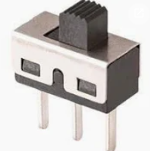

---
canvas:
  allowed_extensions:
  - pdf
  grading_type: pass_fail
  group_assignment: true
  group_set: Project Groups
  points: 1
  published: true
  submission_types:
  - online_upload
  type: assignment
title: Lab 8 – H-Bridge with Manual Switches
---

## Learning Goals

- Understand the H-bridge topology for bi-directional motor control
- Experience forward, reverse, coast, and brake modes
- Learn why shoot-through is destructive and must be prevented

## Background

Read the [H-Bridge Theory](01_HBridge_Theory.qmd) page before starting this lab.

In this lab you replace the MOSFETs with manual **SPDT toggle switches** to build intuition for how the H-bridge works. This is a conceptual exercise before you build the electronic version in Lab 9.

## Components

- 4× SPDT toggle switches (3-pin, 2.54mm pitch — breadboard-friendly)
- 1× 775 DC motor
- 12V power supply **with current limit set to 500mA**
- Breadboard and jumper wires

You can find the toggle switches in solder-room in the assortment box.

::: {.callout-note}

**About SPDT toggle switches:** Each switch has 3 legs — a **common (middle)** pin and two **throw** pins. The middle pin connects to one of the outer pins depending on the switch position. For this lab, treat each toggle as a two-position switch: in one position the leg of the bridge is connected to +12V (or GND), and in the other position it is connected to nothing (or the opposite rail).

A simple way to wire each switch:

- **Common (middle):** to the H-bridge node (motor terminal or rail)
- **One throw pin:** to the rail you want to switch (e.g. +12V for high-side, GND for low-side)
- **Other throw pin:** leave disconnected → switch acts as OPEN in that position

Or, even better — wire both throw pins to the two rails (+12V and GND). Then a single toggle replaces a *pair* of switches (one high-side + one low-side on the same leg), and you cannot accidentally cause shoot-through on that leg. With just **two toggles** (one per leg) you can do forward, reverse, and brake.
See the circuit below.
:::

::: {.callout-warning}
## Overcurrent protection — sacrificial resistor

Try to find a powersuppy that where you can set the max current and **set the current limit to 600mA** before starting. This protects against accidental shoot-through.

Our "brick type" 12V/5A power supply has only a overcurrent protection but no **current limitor**. 
If you only have access to this, add a **sacrificial fuse-resistor** to your circuit: a single **1Ω 1/4W resistor** in series with the +12V rail going into your bridge. At the 775's running current (~0.6A) this dissipates 0.36W — slightly above its rating, so it runs warm but survives a short lab session. On a hard short or sustained overcurrent (>1.5A) it goes into thermal runaway and **fails open within seconds** — protecting the supply, the switches, and the motor. Replace it after each failure.

```
+12V ──[1Ω 1/4W]──┬───────────────┬───
                  │               │
              S_left (SPDT)   S_right (SPDT)
                  │               │
                  ├──── M ────────┤
                  │               │
GND ──────────────┴───────────────┴───
```
:::

## Tasks

<iframe src="https://www.falstad.com/circuit/circuitjs.html?ctz=CQAgjCAMB0l3BWEBmAHAJmgdgGzoRmACzICcpkORI6pISCk9ApgLRhgBQYW6I7OcIIH8iqKCCzg+YPk3nQkANS4BzfmEEc+IzfKiciYJO1kgqIVEwsKkEGMajRHMSHNh2DAZw1nNvvhtwEAAzAEMAGy9mTgB3DS1hbSEDeN1BKxTITh9M-0ygiHComJ9TQOpy8DMmIsjonMtrajya4OKGtOTk3Rq4hOq+VrlOIA" width="100%" height="500"></iframe>

### Option A — Four SPDT switches (one per MOSFET position)

```
    V+ ──┬──────────┬── V+
         │          │
        S1(P)      S3(P)
         │          │
         ├── MOTOR ─┤
         │          │
        S2(N)      S4(N)
         │          │
    GND ─┴──────────┴── GND
```

<iframe src="https://www.tinkercad.com/embed/5a5j006leVi-h-bridge-using-switches?sharecode=PakA9781MQvqT_HIe-BdtFnqGgSoQtJ0YNuzmiUh0qA" width="100%" height="400" style="border: 1px solid #ccc; border-radius: 8px;"></iframe>


::: {.callout-warning}
Tripple-check your connections! Use the simulator first!
:::

Use only the common + one throw pin of each switch (the third pin stays disconnected). Each toggle replaces one MOSFET (S1–S4) in the H-bridge.

1. Build the H-bridge using four SPDT toggle switches and a small motor.
2. Set S1 + S4 to ON simultaneously. Which direction does the motor spin? (**Forward**)
3. Set S3 + S2 to ON simultaneously (with S1 and S4 OFF). Does the motor reverse? (**Reverse**)
4. Set all switches to OFF while the motor is spinning. Does it stop immediately? (**Coast**)
5. While the motor is spinning, set S2 + S4 to ON (both low-side switches). Does it stop faster? (**Brake**)
6. **Carefully** set S1 + S2 to ON (same-leg switches, with current limit set!). What happens to the current reading on the power supply? **This is shoot-through.**

### Option B — Two SPDT switches (shoot-through impossible)


<iframe src="https://www.tinkercad.com/embed/jzi3hmk4usN-h-bridge-using-switches-safe?sharecode=J6G-PFo5aEHhV82FwFZrzwSDJo0O2ia1ehjPKfQ1JWw" width="100%" height="400" style="border: 1px solid #ccc; border-radius: 8px;"></iframe>

::: {.callout-warning}
Tripple-check your connections! Use the simulator first!
:::

Wire each toggle so that the **common** is one motor terminal, and the two throw pins go to **+12V** and **GND**. One toggle controls each leg of the bridge.


7. With this wiring, try to find a switch combination that causes shoot-through. Why is it impossible? Explain in your report.
8. Find the combinations for forward, reverse, and brake.
9. Why is it harder to achieve "coast" mode with this wiring? (Hint: think about whether the motor terminals can ever both be disconnected.)
10. **Forward → reverse transition:** with the motor spinning in one direction, flick both toggles to reverse position simultaneously. Touch the sacrificial resistor — does it get noticeably warm? Why?

## Questions

1. Why is the H-bridge called an "H"-bridge? Draw the topology.
2. Explain the difference between coast mode and brake mode. When would you use each in the RC car?
3. What could go wrong if there is no dead-time when switching from forward to reverse electronically?
4. The BTS7960 motor driver has built-in shoot-through protection. Why is this important?

## Submission

Write a short lab report in Quarto following the [Report Writing Guide](../01_Fundamentals/01_Report_Writing_Guide.qmd). Include a diagram of your H-bridge circuit, describe what you observed in each mode (forward, reverse, coast, brake, shoot-through), and answer the questions. Render to PDF and upload.