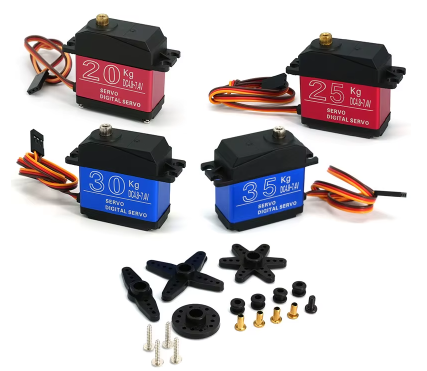
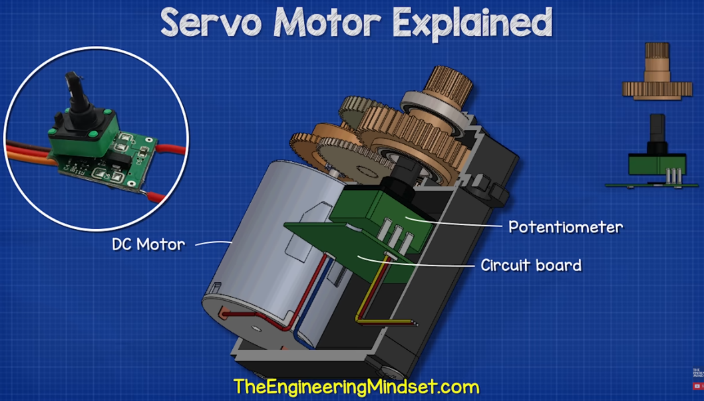
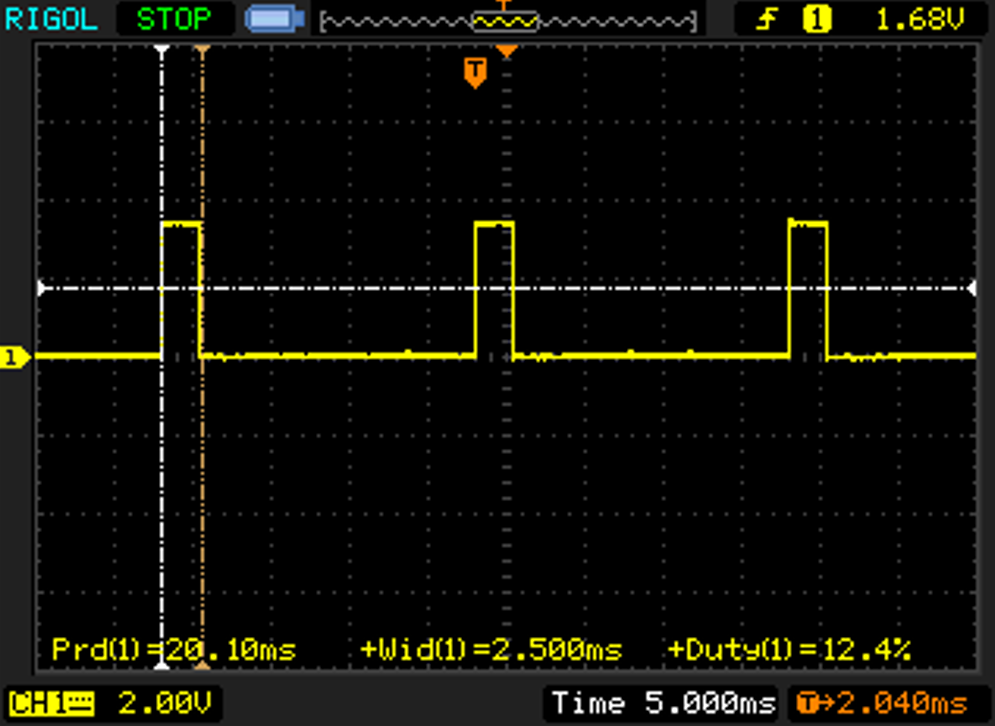
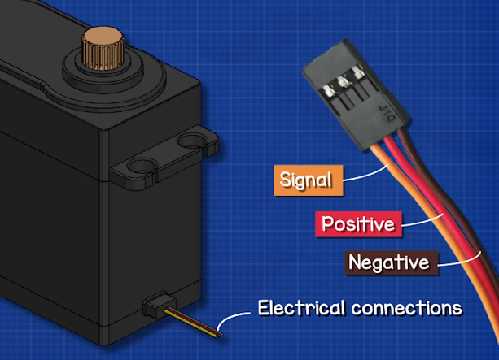

---
canvas:
  allowed_extensions:
  - pdf
  - png
  - jpg
  - jpeg
  - mp4
  - mov
  grading_type: pass_fail
  group_assignment: true
  group_set: Project Groups
  points: 1
  published: true
  submission_types:
  - online_upload
  type: assignment
title: Lab 10 – Driving and Calibrating the Servo
---

## Learning Goals

- Understand the hobby servo signal format (50 Hz, pulse-width encoding)
- Drive a servo using the ESP32 LEDC peripheral directly (no library)
- Calibrate the servo's safe pulse-width limits using current and oscilloscope measurements
- Understand why the servo must be powered separately from the ESP32

## Background

### What is a hobby servo?



A servo motor is a self-contained closed-loop positioner. It has three wires and accepts a pulse-width signal. Inside it contains:

- A **brushed DC motor** with a reduction gearbox
- A **feedback potentiometer** measuring the actual shaft angle
- A **controller PCB** that drives the motor until the shaft reaches the commanded position




You don't drive the motor directly — you send a pulse and the servo handles the rest. It is essentially a P-control loop in a plastic box.

### The signal format



Hobby servos expect a **50 Hz pulse train** (20 ms period). The pulse **width** encodes position; the rest of the period is low:

| Pulse width | Position |
|---|---|
| ~500 µs  | one extreme |
| ~1500 µs | center      |
| ~2500 µs | other extreme |

These are nominal values. Every servo has its own actual safe range — the calibration procedure below finds the real limits for your unit.

### Where 50 Hz comes from

The 50 Hz standard was set in the 1970s by the analog RC industry. Receivers multiplexed up to 8 channels onto a single pulse-position-modulation frame; each slot was 1–2 ms wide and the whole frame fit into ~20 ms. The servos didn't choose 50 Hz — they just had to work with whatever cadence the receiver produced. It became universal and has never changed.

Modern digital servos (like the DS3218) run their internal control loop at hundreds of Hz regardless. They will accept input at 100–333 Hz for fast control loops, but 50 Hz is what works reliably on every servo ever made.

### Power chain



The ESP32 cannot power a servo from its 3.3 V or 5 V pins — the on-board regulators are far too small. Use a **buck converter** from the main supply:

```
12 V supply ──► Buck converter (~6 V) ──► Servo V+
                                    └──► ESP32 VIN (optional, via LDO)
```

A **100 µF electrolytic capacitor** across `VIN`/`GND` near the ESP32 helps it survive the voltage dips that occur when the servo accelerates or stalls.

::: {.callout-warning}
**Do not power the servo from the ESP32's 5V pin (VIN) when running from a PC USB port.** A PC USB port is limited to 500–900 mA — as soon as the servo moves under any load, the voltage sags and the ESP32 **browns out and resets**.

A high-current USB charger or power bank (2 A+ rated) can work in a pinch for light loads, since they can actually supply the current. But for reliable operation under load — and especially for the stall currents the DS3218 can reach — use the **buck converter from the 12 V supply**. Only the signal wire connects to the ESP32. **Common ground is essential** between the ESP32, the buck converter, and the servo.
:::

::: {.callout-important}
## USB and VIN can both power the board

On most ESP32 dev boards, `VIN` is connected to the USB 5 V rail through a Schottky diode. With USB plugged in and the bench supply off, USB back-feeds `VIN` at ~4.7 V — the servo keeps moving weakly. "Power off" is not actually off until both sources are disconnected.

**Quick check:** plug in only USB, then measure `VIN` to `GND` with a multimeter.

| VIN reading | Meaning | Safe to use USB + external together? |
|---|---|---|
| ~4.3–4.8 V | Diode present and working (Schottky ≈ 0.3 V drop, regular silicon ≈ 0.6 V drop — both are fine) | **Yes** — power on external first, USB second. De-power USB first, then external |
| ~5.0 V | No diode — VIN directly tied to USB 5 V | **No.** Never connect external power while USB is plugged in |
| ~0.6 V or other odd low voltage | Diode may be damaged or partially conducting — do not trust the isolation | Treat as **No** until repaired |
| ~0 V | No USB→VIN path | Safe, but power VIN externally always |

If your board reads ~5.0 V (no diode), we have repair options available in the lab:

- **Schottky diodes (on order):** cut the VIN trace and solder a Schottky diode across the gap — the ~0.3 V forward drop is acceptable and gives proper isolation.
- **3.3 V LDO regulators:** if the on-board LDO has failed or runs excessively hot, replacement regulators are available to swap in.

In the meantime: power from USB only (accept reduced torque at ~4.7 V) or from external only (use a USB-to-serial adapter on the UART pins for programming and debug).
:::

### Generating the servo signal with LEDC

The ESP32's **LEDC peripheral** is a hardware PWM generator. At **50 Hz / 16-bit resolution** there are 65 536 ticks per 20 ms frame — one tick is ~0.305 µs, far finer than any servo's ~3 µs dead band.

Converting a pulse width in microseconds to a duty count:

```
duty = pulse_us × 65536 / 20000
```

At 50 Hz the period is 20 000 µs and there are 65 536 ticks in that period, so each microsecond corresponds to `65536 / 20000 ≈ 3.28` ticks.

In code this is written as:

```cpp
uint32_t usToDuty(int us) {
  return (uint32_t)((uint64_t)us * 65536ULL * pwmFreqHz / 1000000ULL);
}
```

The `1000000` comes from converting the frame period: `period_us = 1 000 000 / freq`, so `duty = us × 65536 / (1 000 000 / freq) = us × 65536 × freq / 1 000 000`.

The `(uint64_t)` cast is necessary because the intermediate multiplication overflows a 32-bit integer before the division brings it back down:

```
2500 µs × 65536 × 50 Hz = 8 192 000 000   →  exceeds 32-bit max (4 294 967 295)
```

Without the cast, the result wraps around silently and the servo receives a garbage pulse width. Casting to 64-bit first keeps the full value intact; the final result always fits in 32 bits and is safely cast back.

## Servo Specifications — DS3218-270

| Parameter | Value |
|---|---|
| Working voltage | 4.8 – 7.2 V DC |
| Stall torque | ~20 kg·cm |
| Travel range | 270° |
| Nominal pulse range | 500 – 2500 µs |
| Dead band | ~3 µs |

::: {.callout-note}
The seller listing does **not** give a stall current. For a 20 kg·cm metal-gear servo expect 2–3 A at stall. Size your buck converter accordingly.
:::

## Components

- ESP32 DevKit
- 1× DS3218-270 servo
- 1× Buck converter set to 5.5–6 V
- 1× 100 µF electrolytic capacitor
- 1× Potentiometer (10 kΩ)
- 12 V power supply
- Oscilloscope

## Part A — Hardware Setup

1. **Set the buck converter** output to 5.5–6 V. Verify with a multimeter **before connecting anything**.
2. **Wire** per the table below:


   | From | To |
   |---|---|
   | Buck V+ | Servo red (V+) |
   | Buck GND | Servo brown (GND), ESP32 GND |
   | Buck V+ | ESP32 `VIN` (optional — see power note above) |
   | 100 µF cap + leg | Buck V+ / ESP32 VIN |
   | 100 µF cap − leg | GND |
   | ESP32 `GPIO13` | Servo signal (yellow/orange) |

3. **Check USB↔VIN isolation** with the multimeter check above before proceeding.

## Part B — First Signal

Upload the following sketch. It centers the servo and holds it there — no potentiometer yet. Verify the signal on the oscilloscope before connecting the servo.

```cpp
#include <Arduino.h>

const int servoPin      = 13;
const int pwmChannel    = 0;
const int pwmFreqHz     = 50;   // Hz
const int pwmResolution = 16;   // bits → 65536 ticks per 20 ms

int minPulseUs = 500;
int maxPulseUs = 2500;

uint32_t usToDuty(int us) {
  return (uint32_t)((uint64_t)us * 65536ULL * pwmFreqHz / 1000000ULL);
}

void setup() {
  Serial.begin(115200);
  ledcSetup(pwmChannel, pwmFreqHz, pwmResolution);
  ledcAttachPin(servoPin, pwmChannel);

  // Center the servo
  ledcWrite(pwmChannel, usToDuty(1500));
  Serial.println("Servo centered at 1500 us");
}

void loop() {}
```

4. Probe `GPIO13` on the oscilloscope. Verify:
   - Period = **20 ms** (50 Hz)
   - Pulse width ≈ **1.5 ms**
5. Connect the servo. It should rotate to center.

## Part C — Calibration

Every servo's actual safe range differs from the nominal 500–2500 µs. The calibration sketch below lets you command exact pulse widths over serial and observe the behavior. **You need:**

- Oscilloscope on `GPIO13` (to read actual pulse width)
- Multimeter on the buck converter output (to read current draw)

### Calibration sketch

Upload `src/main.cpp` — or copy the code below:

```cpp
#include <Arduino.h>

// Serial commands (end with newline):
//   u <us>    set pulse width in microseconds, e.g.  u 1500
//   a <deg>   set angle 0..270,                 e.g.  a 135
//   min <us>  set minPulseUs
//   max <us>  set maxPulseUs
//   sweep     auto-sweep min..max and back
//   scan      slow scan 400..2600 us in 50 us steps
//   pot       follow potentiometer on GPIO34
//   stop      hold current position
//   ?         print current state
//   h         show help

const int servoPin      = 13;
const int potPin        = 34;
const int pwmChannel    = 0;
const int pwmResolution = 16;
int pwmFreqHz           = 50;

int minPulseUs = 500;
int maxPulseUs = 2500;
int currentUs  = 1500;

enum Mode { HOLD, SWEEP, SCAN, POT };
Mode mode = HOLD;

uint32_t usToDuty(int us) {
  uint64_t maxDutyPlus1 = 1ULL << pwmResolution;
  return (uint32_t)((uint64_t)us * maxDutyPlus1 * pwmFreqHz / 1000000ULL);
}

void applyUs(int us) {
  currentUs = us;
  uint32_t duty = usToDuty(us);
  ledcWrite(pwmChannel, duty);
  Serial.printf("pulse=%d us   duty=%lu/%lu\n",
    us, (unsigned long)duty,
    (unsigned long)((1UL << pwmResolution) - 1));
}

void displayHelp() {
  Serial.println("Commands: u <us> | a <deg> | min <us> | max <us>");
  Serial.println("          sweep | scan | pot | stop | ? | h");
}

void printState() {
  Serial.printf("f=%d Hz  min=%d  max=%d  current=%d us  mode=%d\n",
    pwmFreqHz, minPulseUs, maxPulseUs, currentUs, mode);
}

void handleLine(String s) {
  s.trim();
  if (!s.length()) return;
  if (s == "h")     { displayHelp(); return; }
  if (s == "?")     { printState();  return; }
  if (s == "stop")  { mode = HOLD;  Serial.println("stopped");  return; }
  if (s == "sweep") { mode = SWEEP; Serial.println("sweeping"); return; }
  if (s == "scan")  { mode = SCAN;  Serial.println("scanning"); return; }
  if (s == "pot")   { mode = POT;   Serial.println("following pot"); return; }

  int sp = s.indexOf(' ');
  if (sp < 0) { Serial.println("unknown command"); return; }
  String cmd = s.substring(0, sp);
  int val = s.substring(sp + 1).toInt();

  if      (cmd == "u")   { mode = HOLD; applyUs(val); }
  else if (cmd == "a")   { mode = HOLD; applyUs(map(constrain(val,0,270), 0, 270, minPulseUs, maxPulseUs)); }
  else if (cmd == "min") { minPulseUs = val; Serial.printf("minPulseUs=%d\n", val); }
  else if (cmd == "max") { maxPulseUs = val; Serial.printf("maxPulseUs=%d\n", val); }
  else                   { Serial.println("unknown command"); }
}

void setup() {
  Serial.begin(115200);
  delay(200);
  ledcSetup(pwmChannel, pwmFreqHz, pwmResolution);
  ledcAttachPin(servoPin, pwmChannel);
  analogReadResolution(12);
  applyUs(1500);
  displayHelp();
  printState();
}

void loop() {
  static String buf;
  while (Serial.available()) {
    char c = Serial.read();
    if (c == '\n' || c == '\r') { if (buf.length()) { handleLine(buf); buf = ""; } }
    else { buf += c; if (buf.length() > 64) buf = ""; }
  }

  static uint32_t tLast = 0;
  static int dir = +1;
  uint32_t now = millis();

  if (mode == SWEEP && now - tLast >= 20) {
    tLast = now;
    int us = currentUs + dir * 10;
    if (us >= maxPulseUs) { us = maxPulseUs; dir = -1; }
    if (us <= minPulseUs) { us = minPulseUs; dir = +1; }
    applyUs(us);
  }
  if (mode == SCAN && now - tLast >= 500) {
    tLast = now;
    int us = currentUs + 50;
    if (us > 2600) us = 400;
    applyUs(us);
  }
  if (mode == POT && now - tLast >= 20) {
    tLast = now;
    int us = map(analogRead(potPin), 0, 4095, minPulseUs, maxPulseUs);
    if (us != currentUs) applyUs(us);
  }
}
```

### Calibration procedure

**Baseline:** send `u 1500`, wait for the servo to settle. Note the current reading `I0` — this is your reference. A well-behaved servo parked at a position draws only a small idle current. When it fights a mechanical stop or the end of its feedback pot, current rises and stays up.

#### Find the upper safe limit

Step upward from center in **50 µs** increments: `u 2000`, `u 2050`, `u 2100`…

| Command | Current (A) | Notes |
|---|---|---|
| u 1500 | I0 (baseline) | center |
| u 2000 | | |
| u 2100 | | |
| … | | |
| *upper safe* | I0 | last value at baseline |
| *first loaded* | above I0 | first value above baseline |
| *hard upper* | drops to I0, horn loose | controller rejected |

Once the current rises, step back down in **10 µs** steps to find the exact edge.

#### Find the lower safe limit

Repeat downward: `u 1000`, `u 950`, `u 900`…

| Command | Current (A) | Notes |
|---|---|---|
| u 1500 | I0 (baseline) | center |
| u 1000 | | |
| u 900 | | |
| … | | |
| *lower safe* | I0 | last value at baseline |
| *first loaded* | above I0 | first value above baseline |
| *hard lower* | drops to I0, horn loose | controller rejected |

::: {.callout-warning}
Never leave the servo parked at a pulse width where current is above baseline — that is a stalled motor and it will heat up.
:::

#### Sanity check

1. Compute the center of your safe window: `(minPulseUs + maxPulseUs) / 2`. It should be close to 1500 µs for a symmetric servo.
2. Update `minPulseUs` and `maxPulseUs` in the code to your measured values.
3. Send `sweep` and let it run for ~30 seconds. Current should oscillate around I0 during travel but never pin high. Touch the servo case — it should be only slightly warm.

## Part D — Potentiometer Control

With calibrated limits in place, send `pot` over serial to follow the potentiometer. The map uses your measured `minPulseUs` and `maxPulseUs`, so the servo travels exactly to its safe limits — no more.

Turn the potentiometer end to end and verify the servo reaches both extremes smoothly.

## Questions

1. Why does the servo signal use **pulse width** to encode position rather than voltage level?
2. The DS3218-270 has a 270° range but the `map()` uses 0–270. What changes in the code if you only want to use the center 180° of travel?
3. **From your calibration tables:** is your servo's safe window symmetric around 1500 µs? If not, what does that tell you about the physical construction?
4. What happens at the **hard rejection limit** — why does the servo go limp outside this window? (Hint: think about what the controller does when a pulse is clearly outside any valid range.)

## Submission

Write a short lab report in Quarto following the [Report Writing Guide](../01_Fundamentals/01_Report_Writing_Guide.qmd). Include:

- Your two calibration tables (upper and lower limit sweep)
- Your measured `minPulseUs` and `maxPulseUs`
- One oscilloscope screenshot showing a 1500 µs pulse with the period and width measurements visible
- A short video or photo sequence showing the servo following the potentiometer
- Answers to the questions

Render to PDF and upload.
