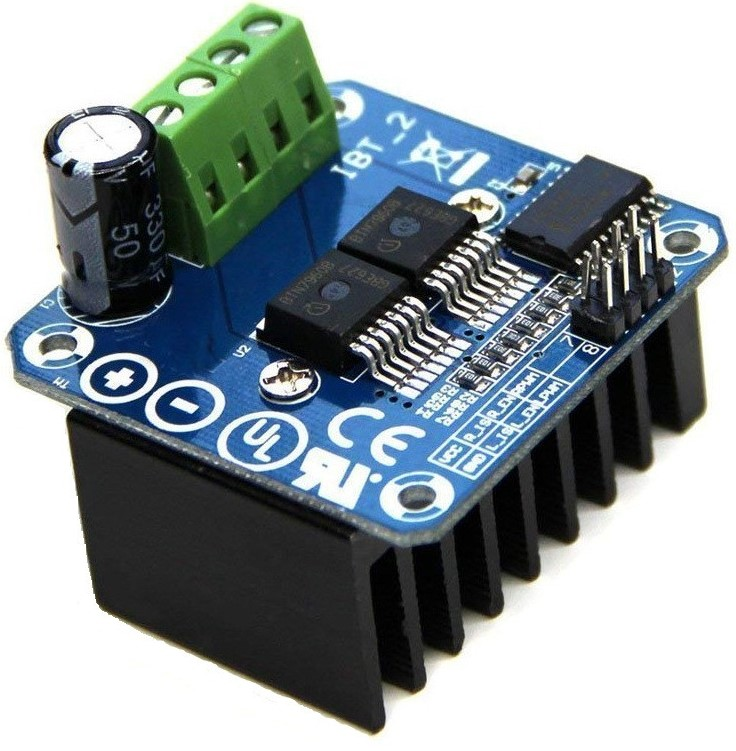
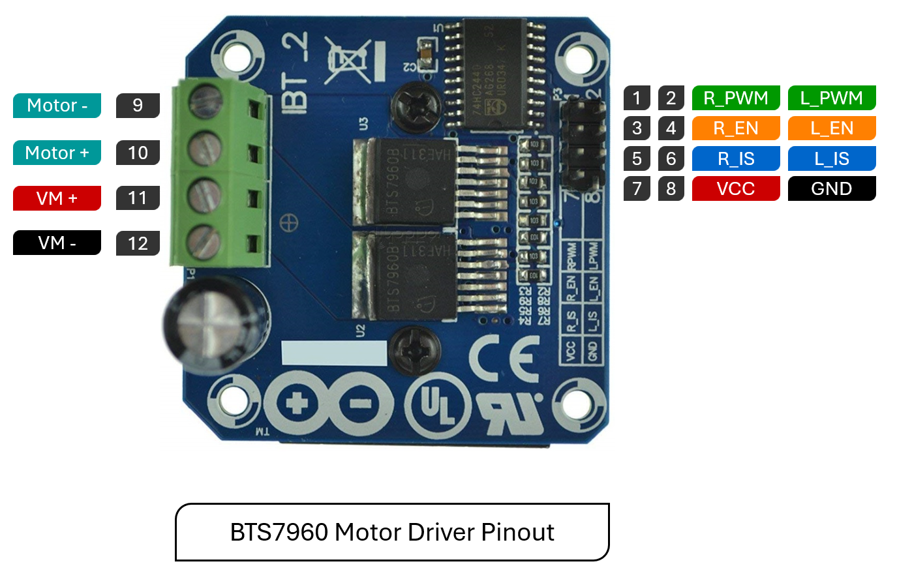

---
canvas:
  allowed_extensions:
  - pdf
  - png
  - jpg
  - jpeg
  - mp4
  - mov
  grading_type: pass_fail
  group_assignment: true
  group_set: Project Groups
  points: 1
  published: true
  submission_types:
  - online_upload
  type: assignment
title: Lab 12 – Driving the Motor with BTS7960
---

## Learning Goals

- Use the BTS7960 motor driver — the same component used in the RC car
- Control the 775 DC motor with RPWM/LPWM signals
- Integrate motor control into the modular code structure from Lab 11
- Understand the difference between your discrete H-bridge (Lab 9) and an integrated driver

## Background



The **BTS7960** (also sold as the IBT-2 module) is a complete H-bridge motor driver rated for 43A peak current. It replaces the entire discrete MOSFET H-bridge from Lab 9 with a single module.



| Pin | Function |
|-----|----------|
| RPWM | PWM input for forward direction |
| LPWM | PWM input for reverse direction |
| R_EN / L_EN | Enable pins (tie to VCC) |
| R_IS / L_IS | Current sense outputs (leave unconnected for now) |
| VCC | Logic power (3.3V or 5V) |
| GND | Logic ground |
| B+ / B- | Motor power input (12V battery) |
| M+ / M- | Motor output |

**Control:** Apply PWM to RPWM (keep LPWM LOW) for forward. Apply PWM to LPWM (keep RPWM LOW) for reverse. Duty cycle controls speed.

### PWM Visualizer

Use the sliders below to see how PWM frequency and duty cycle affect the average voltage delivered to the motor. The red line is the PWM signal; the dashed black line is the average (effective) voltage.

<iframe src="https://mechanics.ju.se/Mechatronics/pwm_visualizer.html"
        width="100%" height="500" frameborder="0"></iframe>


## Components

- ESP32 DevKit
- 1× BTS7960 motor driver module
- 1× 775 DC motor
- 2× Potentiometer (10kΩ)
- 12V power supply or 3S LiPo battery

::: {.callout-warning}
The 775 motor draws high starting current (>10A). Make sure connections are secure. Do not stall the motor for extended periods.
:::

## Part A — Basic Motor Control

1. Wire the BTS7960: B+ to 12V, B- to GND, M+/M- to motor, VCC to 3.3V, R_EN and L_EN to 3.3V.
2. Connect RPWM to GPIO 16, LPWM to GPIO 17.
3. Connect a potentiometer center pin to GPIO 35.
4. Upload the following code and control the motor with the potentiometer:

```cpp
#include <Arduino.h>

const int rpwmPin     = 16;
const int lpwmPin     = 17;
const int potPin      = 35;
const int rpwmChannel = 4;   // channels 0–3 reserved by ESP32Servo library
const int lpwmChannel = 5;
const int pwmFreq     = 20000;  // 20 kHz — above audible range
const int pwmResolution = 8;

// Center deadband
const int potCenter   = 2048;
const int potDeadband = 100;

void setup() {
  Serial.begin(115200);
  ledcSetup(rpwmChannel, pwmFreq, pwmResolution);
  ledcSetup(lpwmChannel, pwmFreq, pwmResolution);
  ledcAttachPin(rpwmPin, rpwmChannel);
  ledcAttachPin(lpwmPin, lpwmChannel);
  ledcWrite(rpwmChannel, 0);
  ledcWrite(lpwmChannel, 0);
}

void loop() {
  int pot = analogRead(potPin);

  if (pot > potCenter + potDeadband) {
    int speed = map(pot, potCenter + potDeadband, 4095, 0, 255);
    ledcWrite(rpwmChannel, speed);
    ledcWrite(lpwmChannel, 0);
    Serial.printf("FORWARD  pot=%4d  speed=%3d\n", pot, speed);
  } else if (pot < potCenter - potDeadband) {
    int speed = map(pot, potCenter - potDeadband, 0, 0, 255);
    ledcWrite(rpwmChannel, 0);
    ledcWrite(lpwmChannel, speed);
    Serial.printf("REVERSE  pot=%4d  speed=%3d\n", pot, speed);
  } else {
    ledcWrite(rpwmChannel, 0);
    ledcWrite(lpwmChannel, 0);
    Serial.printf("DEADBAND pot=%4d\n", pot);
  }
  delay(20);
}
```

5. Test forward and reverse. Verify the dead zone in the middle.
6. Listen to the motor at different PWM frequencies (1 kHz, 5 kHz, 20 kHz). Which is quietest?
7. **Measure the motor current** at no load using the clamp meter. Clamp around one motor wire — no need to break the circuit. Note the current at different speeds.

::: {.callout-tip}
The 775 motor draws several amps — far beyond a standard multimeter's current range. The **clamp meter** is the practical way to measure motor current on assembled systems. You will use this technique throughout the project.
:::

## Part B — Modular Motor Control

Carry over the modular structure from Lab 11. Add `src/motor_control.h` to your project alongside `servo_control.h`:

```cpp
#pragma once
#include <Arduino.h>

const int RPWM_PIN     = 16;
const int LPWM_PIN     = 17;
// Channels 0–3 are auto-allocated by ESP32Servo — use 4 and 5 to avoid conflicts
const int RPWM_CHANNEL = 4;
const int LPWM_CHANNEL = 5;
const int MOTOR_FREQ   = 20000;
const int MOTOR_RES    = 8;

void motorSetup() {
  ledcSetup(RPWM_CHANNEL, MOTOR_FREQ, MOTOR_RES);
  ledcSetup(LPWM_CHANNEL, MOTOR_FREQ, MOTOR_RES);
  ledcAttachPin(RPWM_PIN, RPWM_CHANNEL);
  ledcAttachPin(LPWM_PIN, LPWM_CHANNEL);
  ledcWrite(RPWM_CHANNEL, 0);
  ledcWrite(LPWM_CHANNEL, 0);
}

// speed: -255 (full reverse) to +255 (full forward), 0 = stop
void setMotorSpeed(int speed) {
  speed = constrain(speed, -255, 255);
  if (speed > 0) {
    ledcWrite(RPWM_CHANNEL, speed);
    ledcWrite(LPWM_CHANNEL, 0);
  } else if (speed < 0) {
    ledcWrite(RPWM_CHANNEL, 0);
    ledcWrite(LPWM_CHANNEL, -speed);
  } else {
    ledcWrite(RPWM_CHANNEL, 0);
    ledcWrite(LPWM_CHANNEL, 0);
  }
}
```

Update `main.cpp` to control both servo and motor simultaneously with two potentiometers:

```cpp
#include <Arduino.h>
#include "servo_control.h"
#include "motor_control.h"

const int steerPot    = 34;   // servo potentiometer
const int throttlePot = 35;   // motor potentiometer

void setup() {
  Serial.begin(115200);
  servoSetup();
  motorSetup();
  Serial.println("Servo + motor ready");
}

void loop() {
  int steer    = map(analogRead(steerPot),    0, 4095, -90, 90);
  int throttle = map(analogRead(throttlePot), 0, 4095, -255, 255);

  setSteering(steer);
  setMotorSpeed(throttle);

  Serial.printf("steer=%d deg  throttle=%d\n", steer, throttle);
  delay(20);
}
```

::: {.callout-note}
`main.cpp` never mentions LEDC channels, pin numbers, or pulse widths. Steering and throttle are expressed in natural units (degrees and speed -255..255). This is the structure you will build on for wireless control.
:::

## Questions

1. How many components does your BTS7960 circuit require compared to the discrete MOSFET H-bridge from Lab 9?
2. The BTS7960 has built-in shoot-through protection and dead-time generation. Why is this important — and why did you have to implement dead-time manually in Lab 9?
3. The motor module uses LEDC channels 4 and 5, while the servo (via `ESP32Servo`) auto-allocates channels 0–3. What would happen if both tried to use the same channel?
4. In `setMotorSpeed()`, why is `constrain()` applied before the `if` statement rather than inside it?

## Submission

Upload a **short video** showing the motor and servo responding to two potentiometers simultaneously. Alternatively, upload a PDF report with your component count comparison and answers to the questions.
