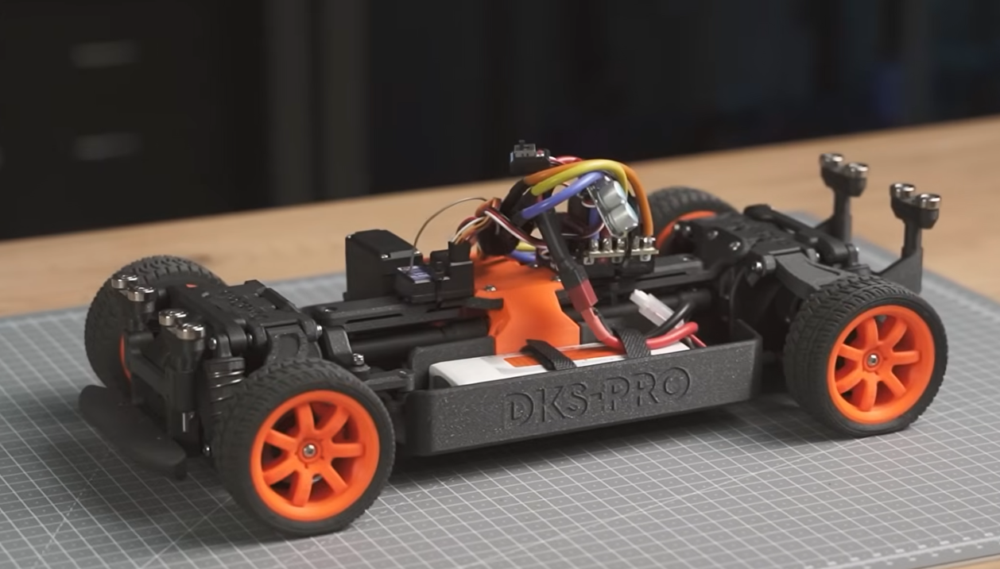
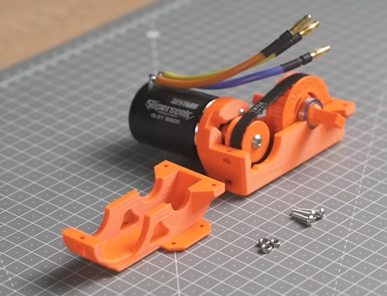
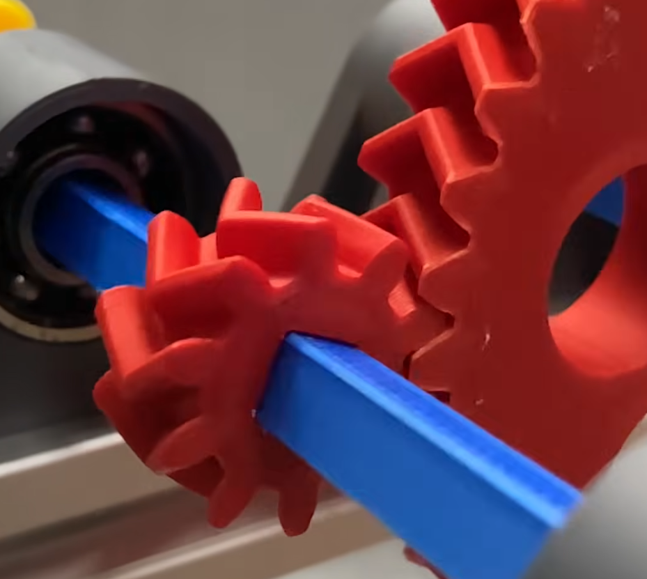

# Overview

You will design and build a remote-controlled car from scratch. The car is powered by a 775 DC motor, steered by a servo, and controlled wirelessly via your phone and/or a physical handheld remote. You will 3D-print the chassis, gears, and wheels, solder the electronics, and write all the code.

This is not just a mechatronics project — the car follows you through several courses in your programme. Decisions you make now affect what you analyze later.

For inspiration, check out [Duke Doks' DKS Pro chassis build](https://dukedoks.com/portfolio/guia-chasis-dks-pro/) (enable English translation). There are many more builds on YouTube — search for "3D printed RC car" to explore different approaches to chassis design, suspension, and drivetrain.

A good starting point is Duke's design, I have bought the same bearings and springs, he has some nice design features (like reinforced axels). However, you are free to design your own chassis and drivetrain. The key is to follow good design principles for 3D printing and mechanical design, and to meet the functional requirements without relying on ready made RC car parts.

# Requirements

## Functional Requirements

The car shall:

- Be propelled by a **775 DC motor** via a **BTS7960 motor driver**
- Be steered by a **DS3218 servo motor** (20 kg-cm torque)
- Be powered by a **3S LiPo battery** (12V) with voltage monitoring and **automatic low-voltage cutoff**
- Use **3D-printed** gears, chassis, and wheels (TPU tires for traction)
- Reach at least **10 km/h**
- Be approximately **30–40 cm** long (multi-part chassis joined with M3 fasteners)
- Have a **suspension system** with springs (see [Synergy with Mechanics](#sec-mechanics))

## Control Methods

### 1. Phone Control via WiFi (required in this course)

The ESP32 creates a WiFi access point. Connect with your phone, open a web page with virtual joysticks, and drive via WebSockets. The interface also shows live telemetry: battery voltage and ground speed (AS5600 magnetic encoder).

### 2. Physical Handheld Remote (prototype now, completed in Peter's course)

A dedicated controller built with a XIAO ESP32, one or two joystick modules, and a 1S LiPo battery (the XIAO has built-in charging). A switch toggles the battery terminal of the XIAO. Communication with the car uses ESP-NOW, a fast low-latency protocol that needs no WiFi network.

The physical remote will be a formal part of **Peter's course after the summer**. However, you should start thinking about the electronics now and make a rough prototype during this course. The ESP-NOW communication lab (Lab 14) gives you the foundation. Both control methods coexist: the car listens for ESP-NOW and WebSocket messages simultaneously.

One option is to enable the physical remote to hold the phone making the phone display the telemetry. This way, you can have the best of both worlds: the tactile control of a physical remote and the rich feedback of a phone interface.

## Throttle and Braking Logic

The car must implement proper throttle logic:

- **Forward**: Positive throttle drives the motor forward
- **Coast**: Zero throttle lets the car roll freely
- **Brake**: Negative input while moving forward **brakes** (using BTS7960 brake mode — low-side short), it does **not** reverse
- **Reverse**: Only engages from standstill

For higher grades, implement battery cutoff failsafe, signal-loss failsafe, and consider speed feedback from the AS5600 for telemetry or closed-loop control.

# Mechanical Design

## Chassis

The chassis should be designed as multiple 3D-printed parts joined with M3 fasteners. This makes it printable on standard build plates and allows individual parts to be reprinted if damaged. Aim for 30–40 cm total length.

Follow best practices for 3D printing: [Design for 3D Printing](https://blog.rahix.de/design-for-3d-printing/). Key points:

- Orient parts to minimize support material
- Use appropriate wall thickness (minimum 2 mm for structural parts)
- Design snap-fits and screw bosses with tolerances for your printer
- Consider print orientation for strength — layer lines are weak in tension
- Use chamfers/fillets to reduce stress concentrations

## Suspension {#sec-mechanics}

**This is a synergy with your parallel Mechanics course.** You must design a suspension system with springs. The suspension geometry, spring forces, damping, and load distribution you design here become the subject of your mechanics analysis. Coordinate with your mechanics teacher on what analysis is expected.

Think carefully about:

- Suspension travel and spring stiffness
- Mounting points and geometry (double wishbone, trailing arm, etc.)
- How the suspension interacts with steering geometry

## Transmission and Gearing

The 775 motor spins at high RPM and low torque — you need gear reduction to drive the wheels. Options:

- **Belt drive**: Belts are available in the lab supply. Simple, quiet, and forgiving of slight misalignment.

- **3D-printed gears**: If you choose printed gears, use **herringbone gear design**. Herringbone gears cancel axial thrust forces and run smoother than spur gears. 

- **Combination**: Belt from motor to a jackshaft, then gears to the axle.

There is **no formal requirement for the car to be 4WD** — a simple rear-wheel drive with a single motor is perfectly acceptable. However, if you want to explore differentials or 4WD, you are free to do so.

### Looking Ahead

**Machine Elements (LP2, autumn)**: You will revisit the gearing, transmission, and drivetrain with proper engineering calculations — gear tooth stresses, bearing selection, shaft dimensioning. The gears you design by intuition now get validated with real analysis. Keep your CAD files organized.

**Solid Mechanics (after summer)**: Structural analysis of your 3D-printed parts. Model the controller enclosure for the XIAO, joysticks, battery, and switch. Analyze stresses and deflections under load. Consider adding a phone holder for reading telemetry while driving.

## Wheels

Print wheel rims in **PLA** and tires in **TPU** for traction and shock absorption. Design the tire tread pattern for the surface you will drive on.

## Materials

- **PLA**: Default material for most parts — stiff, easy to print, good dimensional accuracy
- **PETG**: For parts where some flexibility and layer adhesion strength is preferred over PLA's stiffness
- **Carbon fibre reinforced polycarbonate (CF-PC)**: For critical structural parts that need impact resistance and toughness (motor mounts, suspension arms, gear housings)
- **TPU**: For tires — flexible, high grip, absorbs vibration. Printed without top and bottom layers using gyroid infill 5-20% for maximum flexibility

**Printing with anything other than PLA requires training by Mirza.** Contact Mirza before printing in PETG, CF-PC, or TPU. In later courses on material mechanics, you will analyze how material choice affects structural performance.

### Printer Assignments

- **Prusa MK4S (PLA)**: Default printers for most parts
- **Prusa MK4S (TPU/PETG)**: Dedicated machines for flexible and PETG prints — ask Mirza for access
- **Prusa Core One**: For exotic materials requiring higher temperatures and an enclosed environment (CF-PC, CF-Nylon, etc.) — ask Mirza for training
- **Prusa XL**: Reserved for multimaterial prints and advanced printing only. Not a substitute for fasteners or an excuse to print oversized parts.

## 3D Printing Rules

- **Keep prints small.** The chassis is designed as multiple small parts joined with M3 fasteners. Do not try to print the entire frame as one piece — test everything using as little material as possible.
- Follow best practices: [Design for 3D Printing](https://blog.rahix.de/design-for-3d-printing/)
- **Label your parts** — when you have 10+ chassis pieces, it helps to emboss part numbers
- **Version your designs** — save STL files alongside your CAD source files

# Electronics

## Power System

- **3S LiPo battery** (11.1V nominal, 12.6V fully charged)
- **Buck converter** steps down to 5V for the ESP32 and servo
- **Voltage divider** monitors battery voltage via ADC (Lab 12)
- Implement **automatic cutoff** at 9.9V (3.3V per cell) to protect the battery

## Motor Control

- **BTS7960** dual H-bridge motor driver handles the 775 motor
- PWM controls speed, direction pins control forward/reverse/brake
- The BTS7960 supports active braking (low-side short circuit)

## Sensors

- **AS5600** magnetic rotary encoder on a wheel for speed measurement
- Used for telemetry (display on phone) and optionally for closed-loop speed control

## Communication

- **WiFi (WebSockets)**: ESP32 AP mode, phone connects directly
- **ESP-NOW**: Peer-to-peer, low-latency protocol for the physical remote
- Both can run simultaneously on the same ESP32

# Deliverables

## Submission

Upload the following files to this assignment **before** your presentation slot:

1. **Presentation (`.pptx`)** — a PowerPoint presentation covering:
   - System overview (block diagram of electronics, mechanical layout)
   - Design decisions and trade-offs
   - Challenges faced and how you solved them
   - A short demo video (embedded or linked)

2. **Project archive (`.zip`)** — a zip file containing **all** project files:
   - Source code (PlatformIO project folder)
   - CAD files (STEP, STL, Fusion 360 project, or equivalent)
   - Wiring diagrams or schematics
   - Any other documentation (photos, test data, BOM)

Keep your files well-organized with a clear folder structure. Name the zip `GroupNN_RC_Car.zip`.

## Demonstration (Week 22, Thursday + Friday)

1. **Drive the car.** Show it running under phone control. Demonstrate forward, reverse, braking, and steering.
2. **Explain the design.** Walk through the electronics, mechanical design, and code using your presentation.
3. **Answer questions.** The examiner randomly selects who answers. Every group member must be able to explain all parts.

## What to Bring

- The car, fully assembled and functional
- The phone control interface running
- Your presentation on a laptop
- Your code accessible for review

See the [Study Guide](../00_Course Documents/03_StudyGuide-Mechatronics.qmd) for grading criteria and examination details.
